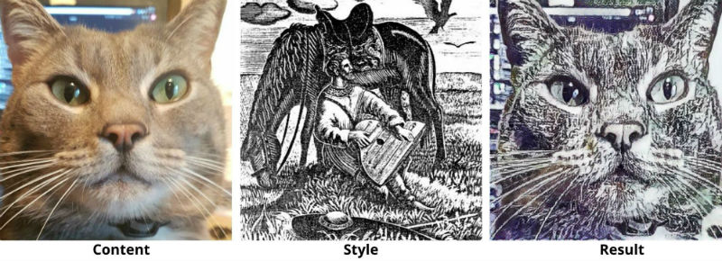
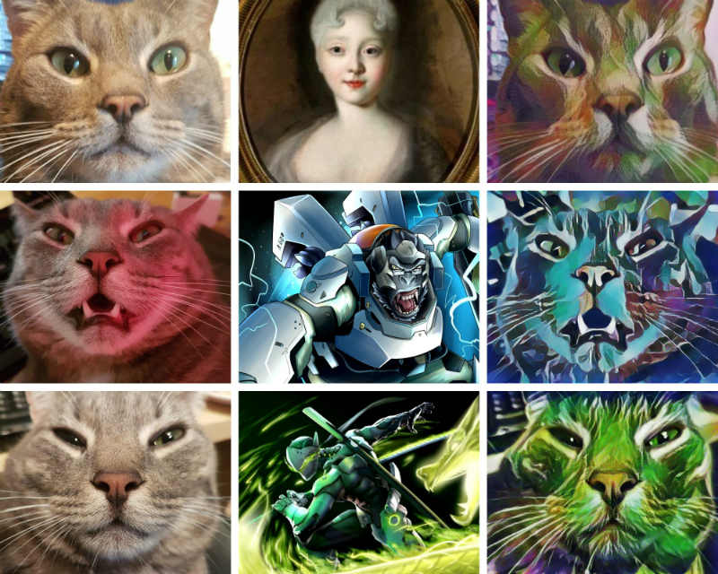
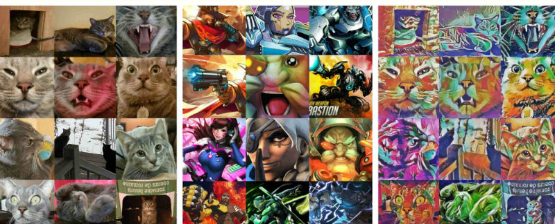

# fifty-shades-of-miaw
Neural Style Transfer on cat pictures.
See blog post that describes the project [here](https://www.trinilearn.com/neural-style-transfer-50-shades-of-miaw/).

## Neural Style Transfer
A Neural Style Transfer model takes two images as input and generates a new image.

The generated image combines the content of the first image with the style of the second one.



I used this project to make some horrible cat art with a pre-trained model from Tensorflow.



I printed the result of the next one on a canvas and I regret it.




## Install

Go in the root of the project and run

```bash
pipenv install
```

## Run

Check the examples in [fifty_shades/example.py](fifty_shades/example.py)

```python
from fifty_shades.loader import generate_image_tensors
from fifty_shades.model import NeuralStyleTransfer


save_directory = "my/save/dir"
cat_generator = generate_image_tensors("path/to/cat/dir")
style_generator = generate_image_tensors("path/to/style/dir")
model = NeuralStyleTransfer()
model.predict_and_save_all(cat_generator, style_generator, save_directory)
```
